# Android开发环境配置

**android studio下载地址：[下载 Android Studio 和应用工具 - Android 开发者  | Android Developers](https://developer.android.com/studio?hl=zh-cn)**

**jdk下载安装：[（超详细）2022年最新版java 8（ jdk1.8u321）安装教程_java8下载-CSDN博客](https://blog.csdn.net/JunLeon/article/details/122623465)**

- 第一次运行自动检测Android SDK的位置，会出现以下错误（点击cancel进入下一步）：

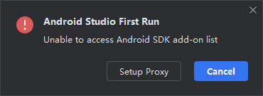

- 选择自定义的安装配置：

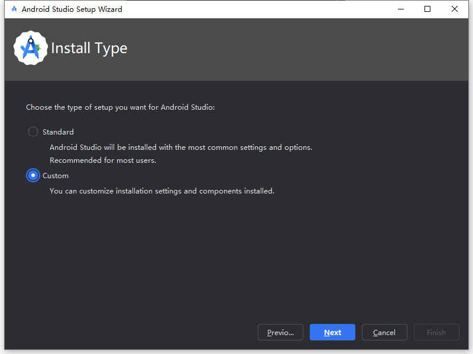

- 根据需求选择相应的选项进行下载：

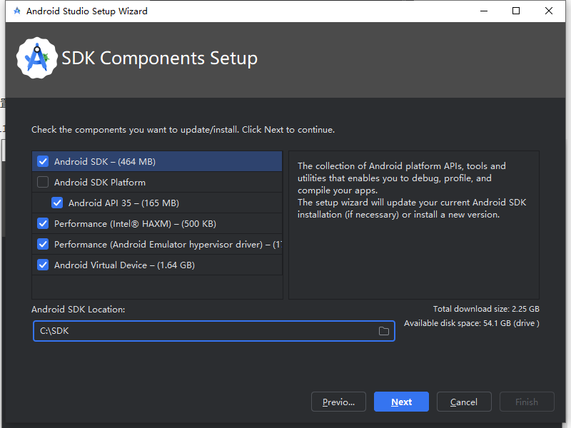

- 为HAXM设置可用内存（加速android studio模拟器）：

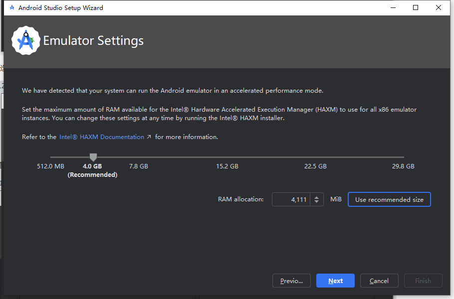

- 等待下载完成：

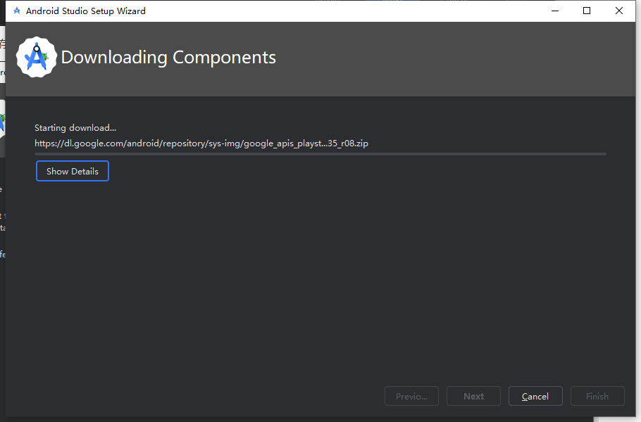

- 网络出现问题无法进行下载，点击cancel，打开android studio新建项目，打开SDK Manager：

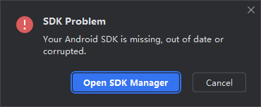

- 下载

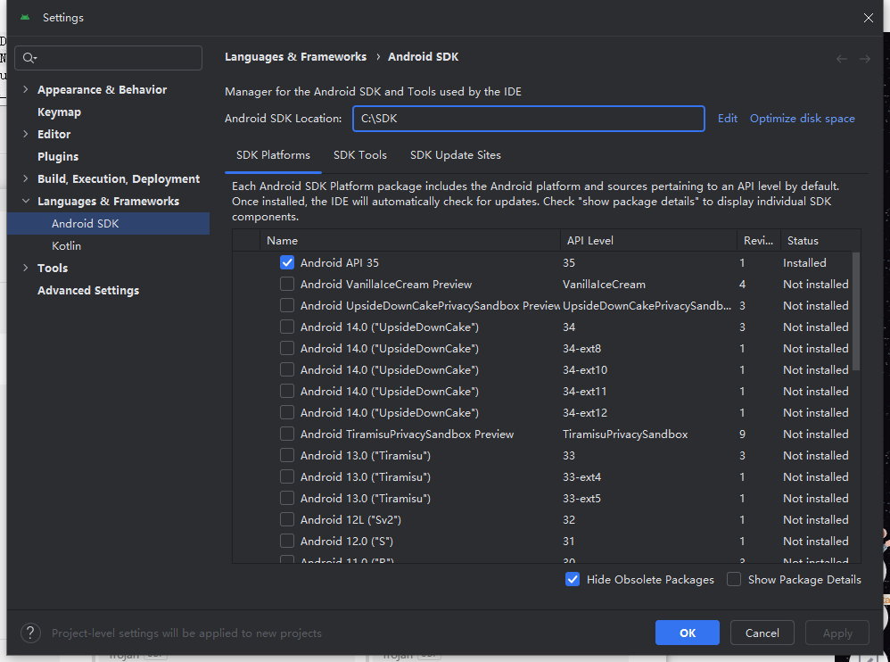

- 配置HAXM（安装失败）

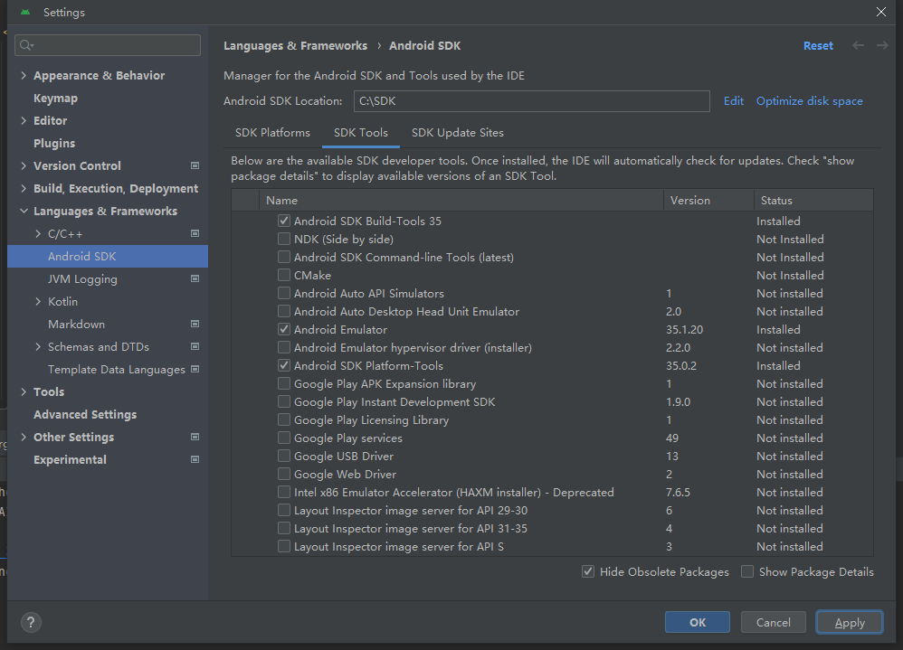

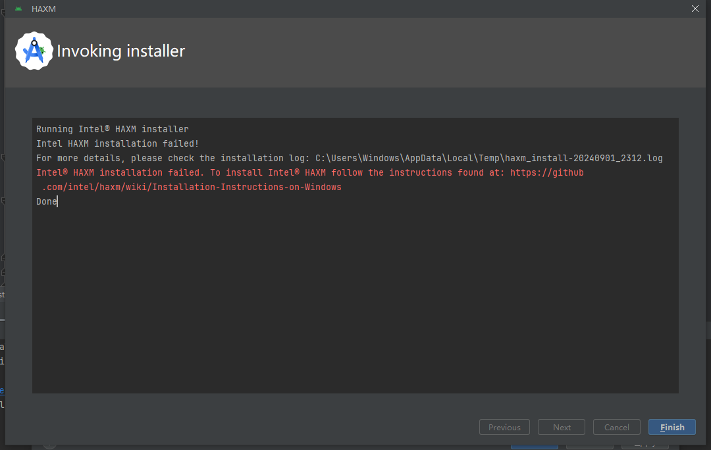

- 配置virtual device

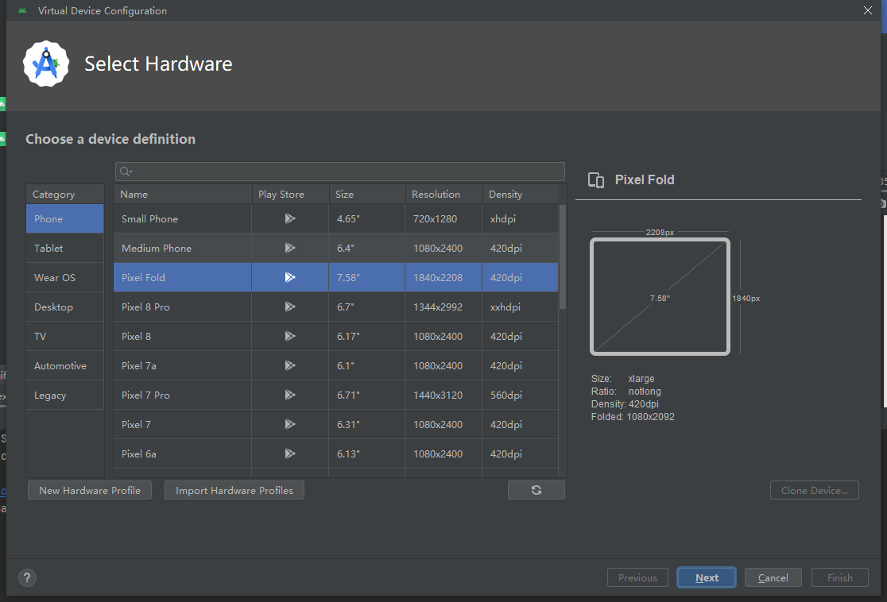

- 运行项目

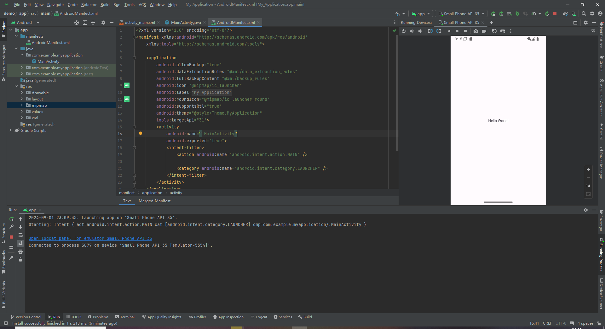