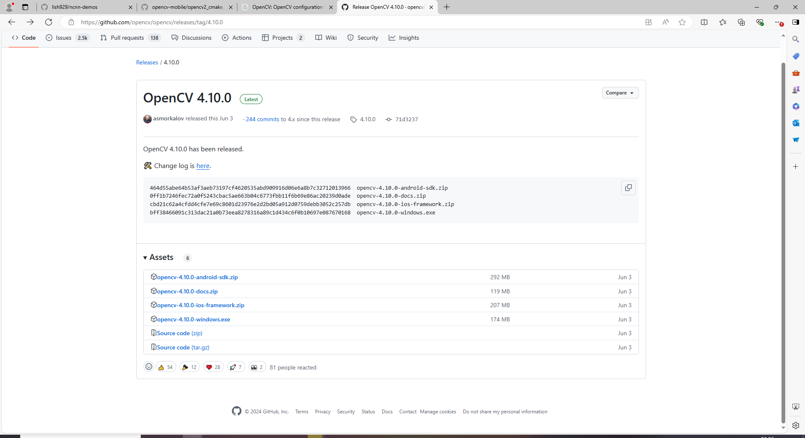
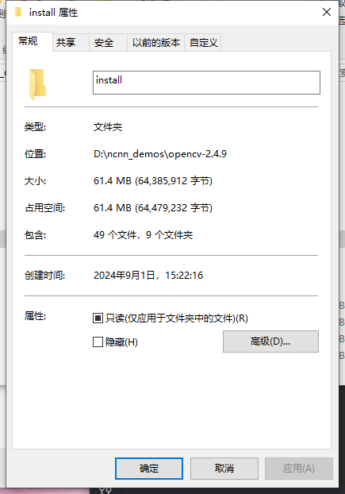
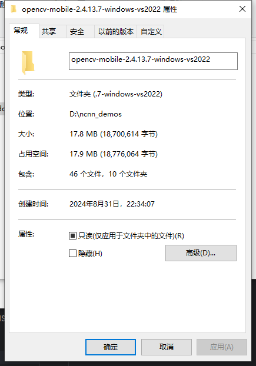
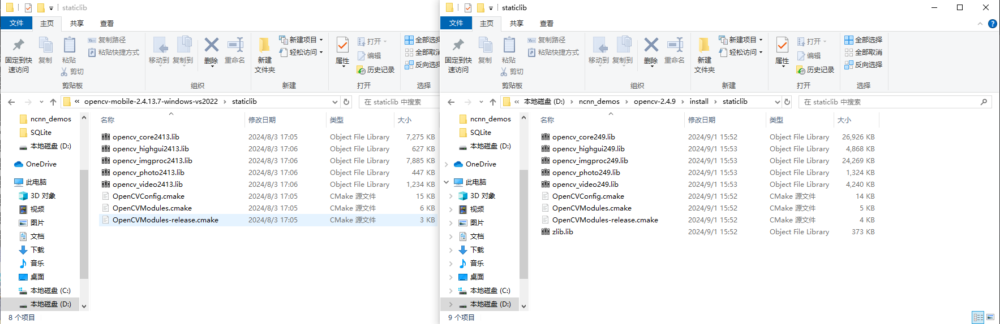
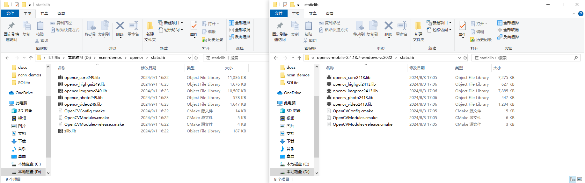

# 编译opencv


### windows编译

- 可以从opencv的GitHub中进行下载编译好的包：[Release OpenCV 4.10.0 · opencv/opencv (github.com)](https://github.com/opencv/opencv/releases/tag/4.10.0)

​		这样做有一个问题，下载已经编译好的库较大，在某些项目中不符合需求，可以下载源码包选择需要的模块进行编辑，可以在满足需求的条件下大幅减小编译后库的大小。



- 使用visual studio 2022编译

  - 下载源码（上面给出的网址 以2.4.9版本为例）

  - 编写bat脚本进行编译

    [OpenCV: OpenCV configuration options reference](https://docs.opencv.org/4.x/db/d05/tutorial_config_reference.html)

    [OpenCV详细介绍，包含的模块以及组成结构_opencv底层是运行什么-CSDN博客](https://blog.csdn.net/qq_40613308/article/details/105142027)

    [OPENCV 编译选项以及解释_opencv编译d3d11-CSDN博客](https://blog.csdn.net/qq_40147007/article/details/131811609)

  ​		根据网上查询到的编译选项，编译好完成后，发现开启了-DBUILD_ZLIB=OFF选项，但是依旧会出现zlib的库文件，同时对比opencv-mobile的大小差距也比较大（lib库文件大小差距大）：

  

  

  

  - 在opencv-mobile的仓库copy opencv2的编译options：[opencv-mobile/opencv2_cmake_options.txt at master · nihui/opencv-mobile (github.com)](https://github.com/nihui/opencv-mobile/blob/master/)

    ​	根据opetions.txt提供的编译选项（网上查询到的编译选项并不完整，跟opencv-mobile提供的差距有点大）重新编写编译脚本，编译完成后，库文件大小差距不大，但是zlib的库文件依旧还是编译出来了

```bat
@Rem 编译opencv静态库

set ARC=x64
set VS=2022
set BUILD_TYPE=Release
set OPENCV_ROOT=D:\ncnn_demos\opencv-2.4.9
set BUILD_DIR=D:\ncnn_demos\opencv-2.4.9\build
set INSTALL_DIR=D:\ncnn_demos\opencv-2.4.9\install

@echo off

if %ARC% == x86 (
	echo "build x86"
	call "C:\Program Files\Microsoft Visual Studio\%VS%\Community\VC\Auxiliary\Build\vcvars32.bat"
) else (
	echo "build x64"
	call "C:\Program Files\Microsoft Visual Studio\%VS%\Community\VC\Auxiliary\Build\vcvars64.bat"
)

if exist "%BUILD_DIR%" rd /s /q "%BUILD_DIR%"
mkdir "%BUILD_DIR%"

@REM -DBUILD_opencv_world=ON

cmake %OPENCV_SOURCES_PATH% ^
-DCMAKE_BUILD_TYPE=%BUILD_TYPE% ^
-DCMAKE_SYSTEM_NAME=Windows ^
-DBUILD_WITH_STATIC_CRT=ON ^
-DBUILD_SHARED_LIBS=OFF ^

-DBUILD_opencv_apps=OFF ^
-DBUILD_ANDROID_EXAMPLES=OFF ^
-DBUILD_DOCS=OFF ^
-DBUILD_EXAMPLES=OFF ^
-DBUILD_PACKAGE=OFF ^
-DBUILD_PERF_TESTS=OFF ^
-DBUILD_TESTS=OFF ^
-DBUILD_WITH_DEBUG_INFO=OFF ^
-DBUILD_WITH_STATIC_CRT=OFF ^
-DBUILD_FAT_JAVA_LIB=OFF ^
-DBUILD_ANDROID_SERVICE=OFF ^
-DBUILD_ANDROID_PACKAGE=OFF ^
-DBUILD_TINY_GPU_MODULE=OFF ^
-DBUILD_ZLIB=OFF ^
-DBUILD_TIFF=OFF ^
-DBUILD_JASPER=OFF ^
-DBUILD_JPEG=OFF ^
-DBUILD_PNG=OFF ^
-DBUILD_OPENEXR=OFF ^
-DBUILD_TBB=OFF ^
-DENABLE_DYNAMIC_CUDA=OFF ^
-DENABLE_PRECOMPILED_HEADERS=OFF ^

-DWITH_AVFOUNDATION=OFF ^
-DWITH_CARBON=OFF ^
-DWITH_CUDA=OFF ^
-DWITH_VTK=OFF ^
-DWITH_CUFFT=OFF ^
-DWITH_CUBLAS=OFF ^
-DWITH_EIGEN=OFF ^
-DWITH_FFMPEG=OFF ^
-DWITH_GSTREAMER=OFF ^
-DWITH_GTK=OFF ^
-DWITH_IMAGEIO=OFF ^
-DWITH_IPP=OFF ^
-DWITH_JASPER=OFF ^
-DWITH_JPEG=OFF ^
-DWITH_OPENEXR=OFF ^
-DWITH_PNG=OFF ^
-DWITH_TIFF=OFF ^
-DWITH_QUICKTIME=OFF ^
-DWITH_QTKIT=OFF ^
-DWITH_TBB=OFF ^
-DWITH_OPENMP=ON ^
-DWITH_V4L=OFF ^
-DWITH_LIBV4L=OFF ^
-DWITH_OPENCL=OFF ^

-DBUILD_opencv_java=OFF ^
-DBUILD_opencv_androidcamera=OFF ^
-DBUILD_opencv_ts=OFF ^
-DBUILD_opencv_python2=OFF ^
-DBUILD_opencv_python3=OFF ^
-DBUILD_opencv_gpu=OFF ^
-DBUILD_opencv_dynamicuda=OFF ^
-DBUILD_opencv_ocl=OFF ^
-DBUILD_opencv_imgcodecs=OFF ^
-DBUILD_opencv_videoio=OFF ^
-DBUILD_opencv_calib3d=OFF ^
-DBUILD_opencv_flann=OFF ^
-DBUILD_opencv_objdetect=OFF ^
-DBUILD_opencv_stitching=OFF ^
-DBUILD_opencv_ml=OFF ^
-DBUILD_opencv_superres=OFF ^
-DBUILD_opencv_videostab=OFF ^
-DBUILD_opencv_viz=OFF ^
-DBUILD_opencv_contrib=OFF ^
-DBUILD_opencv_features2d=OFF ^
-DBUILD_opencv_legacy=OFF ^
-DBUILD_opencv_nonfree=OFF ^

-DBUILD_PACKAGE=OFF ^
-B%BUILD_DIR% ^
-H%OPENCV_ROOT% ^
-GNinja

ninja -C %BUILD_DIR%

timeout /T 3 /NOBREAK

cmake --install %BUILD_DIR% --prefix %INSTALL_DIR% -v

cmd.exe /k

```



​		同时也可以按照opencv-mobile提供的步骤进行编译。