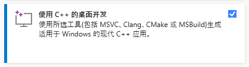
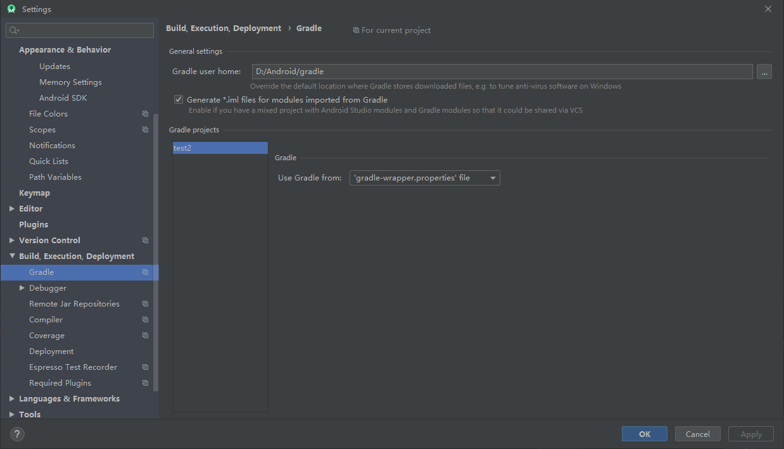
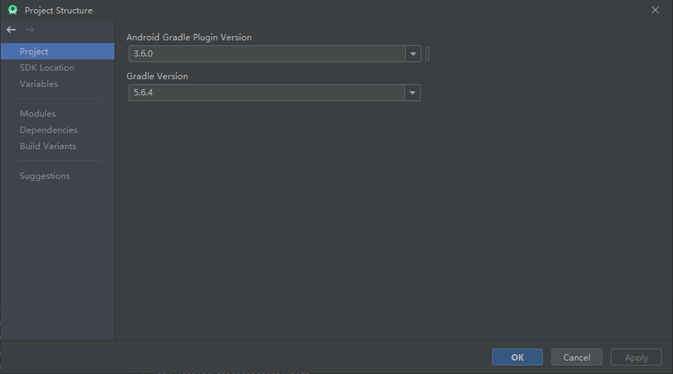
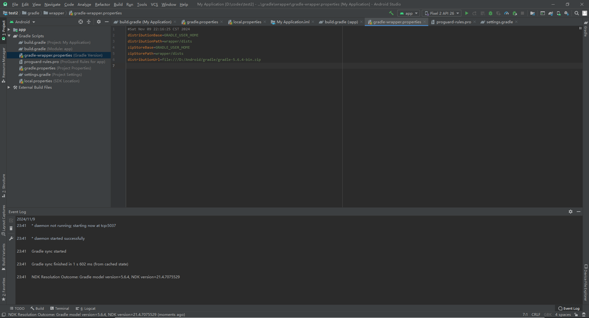
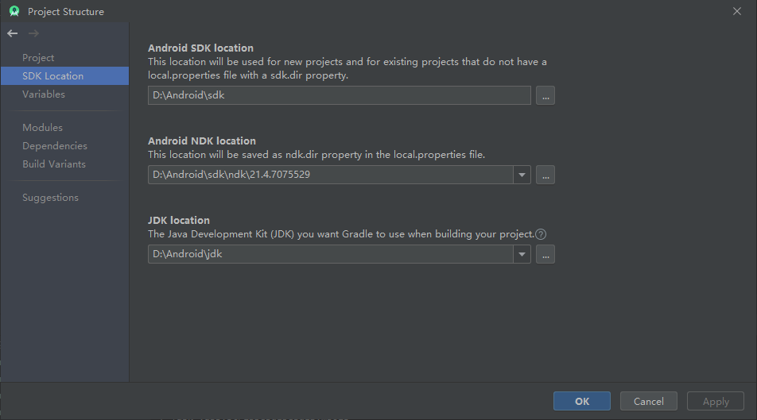
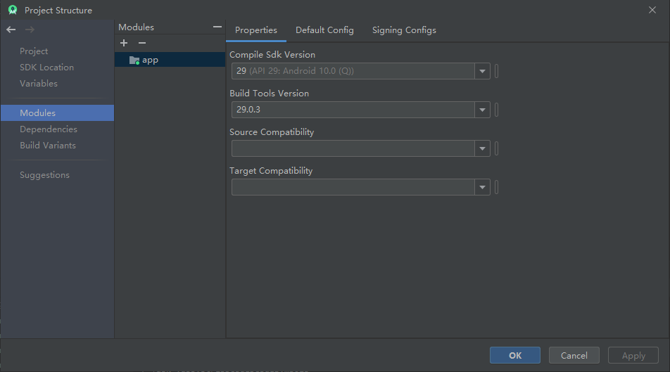
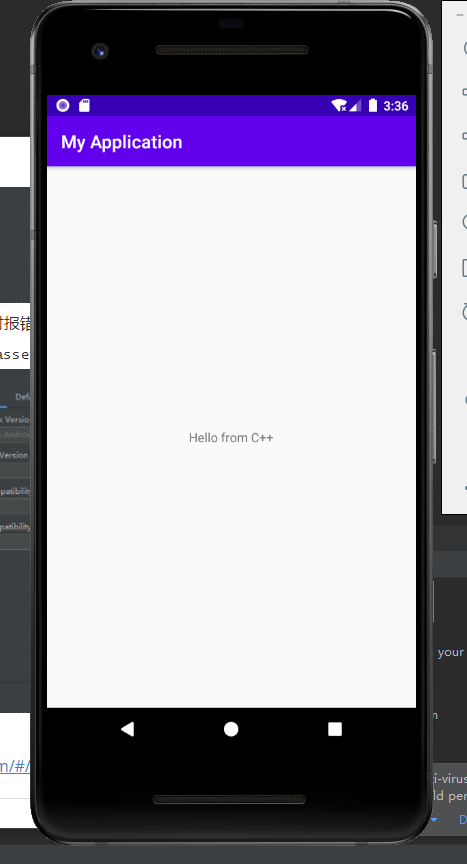

### 环境搭建

##### 编译环境搭建

- cmake
  - 下载并解压
  - 注册环境变量

- visual studio 2022

  - https://visualstudio.microsoft.com/zh-hans/thank-you-downloading-visual-studio/?sku=Community&channel=Release&version=VS2022&source=VSLandingPage&cid=2030&passive=false

  - 选择c++开发

    

##### 编译ncnn

- 拉取代码

  ```
  git clone https://github.com/Tencent/ncnn.git
  cd ncnn
  git submodule update --init
  ```

- 下载protobuf：https://github.com/google/protobuf/archive/v3.11.2.zip

- 使用scripts/build_protobuf.bat进行编译

- 下载安装Vulkan：https://link.zhihu.com/?target=https%3A//vulkan.lunarg.com/sdk/home%23windows

- 使用使用scripts/build_ncnn.bat进行编译

##### 编译opencv-mobile

- 下载代码：[Tags · nihui/opencv-mobile](https://github.com/nihui/opencv-mobile/tags)

  选择需要的源码版本：https://github.com/nihui/opencv-mobile/releases/download/v30/opencv-mobile-4.10.0.zip

- 使用scripts/build_opencv.bat进行编译


##### Android环境配置

- 配置JDK8

  - 下载JDK8：[https://www.oracle.com/java/technologies/javase/javase-jdk8-downloads.html](https://links.jianshu.com/go?to=https%3A%2F%2Fwww.oracle.com%2Fjava%2Ftechnologies%2Fjavase%2Fjavase-jdk8-downloads.html)

  - 解压压缩包并配置环境变量

    ```
    JAVA_HOME D:\Android\jdk
    CLASSPATH .;%JAVA_HOME%\lib;%JAVA_HOME%\lib\dt.jar;%JAVA_HOME%\lib\tools.jar;
    Path %JAVA_HOME%\bin %JAVA_HOME%\jre\bin
    ```

  - 注意：在设置Path变量时，如果是分行显示则一行填写一个，不用添加任何符号（分行显示使用.;%JAVA_HOME%\bin;%JAVA_HOME%\jre\bin的形式有的电脑上不行）

  

- 安装Android命令行工具

  - 下载链接：https://links.jianshu.com/go?to=https%3A%2F%2Fdeveloper.android.google.cn%2Fstudio%3Fhl%3Dzh-cn

  - 注意：命令行工具需要根据jdk版本决定，参考：[Android cmdline-tools 版本与其最小JDK关系-CSDN博客](https://blog.csdn.net/ys743276112/article/details/134024106)

  - jdk8命令行工具下载地址：https://dl.google.com/android/repository/commandlinetools-win-9123335_latest.zip

  - 解压下载安装包并注册环境变量

    

    

- vscode搭建Android环境（坑太多 放弃）

  - 安装platform-tools：app调试需要用到的工具，比如adb、fastboot等

    ```
    sdkmanager --install platform-tools --sdk_root=D:\Android\sdk
    ```

  - 安装build-tools以及platform：build-tools是编译时对应的编译工具，platforms系统的jar包

    API对应参考：[Android 版本号、版本名称、api版本对照表（持续更新）_android版本对照表-CSDN博客](https://blog.csdn.net/wangsheng5454/article/details/117119402)

    ```
    sdkmanager --install build-tools;29.0.3 platforms;android-29 --sdk_root=D:\Android\sdk
    ```

  - 安装仿真镜像以及模拟器：emulator是模拟器，system-images系统的镜像文件，镜像可以随意，支持android-29的就行

    ```
    sdkmanager --install emulator system-images;android-29;google_apis_playstore;x86_64 --sdk_root=D:\Android\sdk
    ```

  - 插件安装

    

    

  - Android Full Surpport模板修改

    C:\Users\Windows\.vscode\extensions\antonydalmiere.android-support-0.6.0\template\newProject路径

    - app/build.gradle

      修改sdk版本

      ```
      plugins {
          id 'com.android.application'
      }
      
      android {
          compileSdk 29
      
          defaultConfig {
              applicationId "{{package}}"
              minSdk 21
              targetSdk 29
              versionCode 1
              versionName "1.0"
      
              testInstrumentationRunner "androidx.test.runner.AndroidJUnitRunner"
          }
      
          buildTypes {
              release {
                  minifyEnabled false
                  proguardFiles getDefaultProguardFile('proguard-android-optimize.txt'), 'proguard-rules.pro'
              }
          }
          compileOptions {
              sourceCompatibility JavaVersion.VERSION_1_8
              targetCompatibility JavaVersion.VERSION_1_8
          }
      }
      
      dependencies {
      
          implementation 'androidx.appcompat:appcompat:1.3.1'
          implementation 'com.google.android.material:material:1.4.0'
          testImplementation 'junit:junit:4.+'
          androidTestImplementation 'androidx.test.ext:junit:1.1.3'
          androidTestImplementation 'androidx.test.espresso:espresso-core:3.4.0'
      }
      ```

    - gradle/wrapper/gradle-wrapper.properties

      修改gradle版本

      ```
      #Mon Oct 18 19:16:13 CEST 2021
      distributionBase=GRADLE_USER_HOME
      distributionUrl=https\://services.gradle.org/distributions/gradle-5.6.4-all.zip
      distributionPath=wrapper/dists
      zipStorePath=wrapper/dists
      zipStoreBase=GRADLE_USER_HOME
      ```

    - build.gradle

      修改gradle plugin版本

      ```
      // Top-level build file where you can add configuration options common to all sub-projects/modules.
      buildscript {
          repositories {
              google()
              mavenCentral()
          }
          dependencies {
              classpath "com.android.tools.build:gradle:3.6.4"
      
              // NOTE: Do not place your application dependencies here; they belong
              // in the individual module build.gradle files
          }
      }
      
      task clean(type: Delete) {
          delete rootProject.buildDir
      }
      ```

      gradle gradle plugin jsk版本对应参考：[Android Gradle Plugin与Gradle版本、JDK版本对应关系_gradle7.5.1 对应的jdk-CSDN博客](https://blog.csdn.net/qq_42690281/article/details/131643663)

  - 错误1：Could not find method dependencyResolutionManagement() for arguments [settings_9fx48amztt7ox9m2z9cru9bm0$_run_closure1@15291da] on settings 'android_test' of type org.gradle.initialization.DefaultSettings.参考：[Android studio报错Could not find method dependencyResolutionManagement() for arguments的解决方法-CSDN博客](https://blog.csdn.net/wddptwd28/article/details/123008860)

    ```
    // dependencyResolutionManagement {
    //     repositoriesMode.set(RepositoriesMode.FAIL_ON_PROJECT_REPOS)
    //     repositories {
    //         google()
    //         mavenCentral()
    //         jcenter() // Warning: this repository is going to shut down soon
    //     }
    // }
    rootProject.name = "test"
    include ':app'
    ```

  - 错误2：Cannot resolve external dependency androidx.appcompat:appcompat:1.3.1 because no repositories are defined.参考：[Gradle7.0 降到Gradle4.2出现的问题_cannot resolve external dependency androidx.appcom-CSDN博客](https://blog.csdn.net/qq_41811862/article/details/121114332)

    ```
    // Top-level build file where you can add configuration options common to all sub-projects/modules.
    buildscript {
        repositories {
            google()
            mavenCentral()
        }
        dependencies {
            classpath "com.android.tools.build:gradle:4.2.0"
    
            // NOTE: Do not place your application dependencies here; they belong
            // in the individual module build.gradle files
        }
    }
    
    allprojects {
        repositories {
            google()
            mavenCentral()
        }
    }
    
    task clean(type: Delete) {
        delete rootProject.buildDir
    }
    ```

  - 错误3：SDK location not found. Define location with an ANDROID_SDK_ROOT environment variable or by setting the sdk.dir path in your project's local properties file at 'D:\codes\android_test\local.properties'.参考：[解决“SDK location not found. Define location with sdk.dir in the local.properties“-CSDN博客](https://blog.csdn.net/u010775335/article/details/109615223)

    这里有点奇怪，在环境变量与vscode的setting中设置了ANDROID_SDK_ROOT，但并未起效，最终创建local.properties解决

    ```
    sdk.dir=D:\Android\sdk
    ```

  - 错误4：Could not determine the dependencies of task ':app:processDebugResources'. > java.io.IOException: �ļ�����Ŀ¼��������﷨����ȷ��

    

- Android Studio搭建环境

  - Android Studio历史版本：[Android Studio download archives  | Android Developers](https://developer.android.google.cn/studio/archive#android-studio-3-0?utm_source=androiddevtools&utm_medium=website)

  - 下载安装：[https://redirector.gvt1.com/edgedl/android/studio/install/3.6.0.21/android-studio-ide-192.6200805-windows.exe](https://developer.android.google.cn/studio?hl=zh-cn)

  - 设置环境变量

    ```
    ANDROID_HOME
    %ANDROID_HOME%\tools
    %ANDROID_HOME%\platform-tools 
    
     GRADLE_USER_HOME 
    ```

  - 创建android c++项目

    - 修改setting

      

    - 设置prooject structure

      如果下载gradle慢的话，可以在[Gradle Distributions](https://services.gradle.org/distributions/)下载到本地后，在gradle-wrapper.properties中设置gradle的位置

      

      

      注意一下，需要添加ndk版本

      

      注意一下，选择build的版本为时35时报错，后修改为29

      
      
      项目成功运行
      
      
    
    gradle下载地址：[Gradle Distributions](https://services.gradle.org/distributions/)
    
    版本对应关系：https://chat.chat838.com/#/share/add60cc560ce4c1e85d47f941891a127


##### android交叉编译ncnn

- 配置ndk（可单独下载：http://developer.android.com/ndk/downloads/index.html）

- 注意：

  - 当ndk版本小于r23时使用android.toolchain.cmake，而当ndk大于等于r23时使用android-legacy.toolchain.cmake

  - 查看自身设备cpu所支持的ABIs

    ```
    arm64-v8a
    armeabi-v7a
    armeabi
    ```

    

  - ```
    cmake -DCMAKE_TOOLCHAIN_FILE="C:\SDK\ndk\28.0.12433566\build\cmake\android.toolchain.cmake" -DANDROID_ABI="armeabi-v7a" -DANDROID_ARM_NEON=ON -DANDROID_PLATFORM=android-26 -DNCNN_VULKAN=OFF -G "Unix Makefiles" -DCMAKE_MAKE_PROGRAM="C:\SDK\ndk\28.0.12433566\prebuilt\windows-x86_64\bin\make.exe" ..
    
    cmake --build . -j 8
    cmake --install
    ```

- 注意

  - 在Windows下需要设置-G “Unix Mkaefiles”，配合ndk下的make进行编译
  - 需要注意自己需要的platform版本

- 使用scripts/build_ncnn_android.bat进行编译


##### android交叉编译opencv-mobile

- 下载opencv-mobile：https://github.com/nihui/opencv-mobile/releases/download/v30/opencv-mobile-4.10.0.zip
- 使用scripts/build_opencv_android.bat进行编译
- 注意：编译选项查看options.txt，选择自己所需要的选项


##### ncnn Android部署案例

