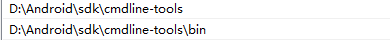

### VSCODE 搭建开发环境

- Android开发环境

  - 配置JDK8

    - 下载JDK8：[https://www.oracle.com/java/technologies/javase/javase-jdk8-downloads.html](https://links.jianshu.com/go?to=https%3A%2F%2Fwww.oracle.com%2Fjava%2Ftechnologies%2Fjavase%2Fjavase-jdk8-downloads.html)

    - 解压压缩包并配置环境变量
  
      ```
      JAVA_HOME D:\Android\jdk
      CLASSPATH .;%JAVA_HOME%\lib;%JAVA_HOME%\lib\dt.jar;%JAVA_HOME%\lib\tools.jar;
      Path %JAVA_HOME%\bin %JAVA_HOME%\jre\bin
      ```
  
    - 注意：在设置Path变量时，如果是分行显示则一行填写一个，不用添加任何符号（分行显示使用.;%JAVA_HOME%\bin;%JAVA_HOME%\jre\bin的形式有的电脑上不行）
  
    
  
  - 安装Android命令行工具
  
    - 下载链接：https://links.jianshu.com/go?to=https%3A%2F%2Fdeveloper.android.google.cn%2Fstudio%3Fhl%3Dzh-cn
  
    - 注意：命令行工具需要根据jdk版本决定，参考：[Android cmdline-tools 版本与其最小JDK关系-CSDN博客](https://blog.csdn.net/ys743276112/article/details/134024106)
  
    - jdk8命令行工具下载地址：https://dl.google.com/android/repository/commandlinetools-win-9123335_latest.zip
  
    - 解压下载安装包并注册环境变量
  
      
  
      
  
  - 配置Android环境
  
    - 安装platform-tools：app调试需要用到的工具，比如adb、fastboot等
  
      ```
      sdkmanager --install platform-tools --sdk_root=D:\Android\sdk
      ```
  
    - 安装build-tools以及platform：build-tools是编译时对应的编译工具，platforms系统的jar包
  
      API对应参考：[Android 版本号、版本名称、api版本对照表（持续更新）_android版本对照表-CSDN博客](https://blog.csdn.net/wangsheng5454/article/details/117119402)
  
      ```
      sdkmanager --install build-tools;29.0.3 platforms;android-29 --sdk_root=D:\Android\sdk
      ```
  
    - 安装仿真镜像以及模拟器：emulator是模拟器，system-images系统的镜像文件，镜像可以随意，支持android-29的就行
  
      ```
      sdkmanager --install emulator system-images;android-29;google_apis_playstore;x86_64 --sdk_root=D:\Android\sdk
      ```
  
    - 安装vscode插件
  
      

### android交叉译ncnn

**参考文档**：[如何构建 ·腾讯/ncnn 维基 (github.com)](https://github.com/Tencent/ncnn/wiki/how-to-build#build-for-android)

- 克隆ncnn：git clone https://github.com/Tencent/ncnn.git

- 下载ndk：[NDK 下载  | Android NDK  | Android Developers](https://developer.android.com/ndk/downloads?hl=zh-cn)

- 编译

  - ```
    cmake -DCMAKE_TOOLCHAIN_FILE="C:\SDK\ndk\28.0.12433566\build\cmake\android.toolchain.cmake" -DANDROID_ABI="armeabi-v7a" -DANDROID_ARM_NEON=ON -DANDROID_PLATFORM=android-26 -DNCNN_VULKAN=OFF -G "Unix Makefiles" -DCMAKE_MAKE_PROGRAM="C:\SDK\ndk\28.0.12433566\prebuilt\windows-x86_64\bin\make.exe" ..
    
    cmake --build . -j 8
    cmake --install
    ```

- 注意

  - 在Windows下需要设置-G “Unix Mkaefiles”，配合ndk下的make进行编译
  - 需要注意自己需要的platform版本
  - 编译选项查看ncnn下的CmakeLists.txt，选择自己所需要的选项


### 交叉编译opencv-mobile

**参考文档**：https://github.com/nihui/opencv-mobile/blob/master/README.md

- 下载opencv-mobile：https://github.com/nihui/opencv-mobile/releases/download/v30/opencv-mobile-4.10.0.zip

- ```
  cmake -DCMAKE_BUILD_TYPE=Release -DBUILD_opencv_world=OFF -DCMAKE_TOOLCHAIN_FILE="C:\SDK\ndk\28.0.12433566\build\cmake\android.toolchain.cmake" -G "Unix Makefiles" -DCMAKE_MAKE_PROGRAM="C:\SDK\ndk\28.0.12433566\prebuilt\windows-x86_64\bin\make.exe" -DANDROID_PLATFORM=android-26 -DCMAKE_ANDROID_ARCH_ABI=armeabi-v7a -DANDROID_NATIVE_API_LEVEL=26 ..
  
  cmake --build -j 8
  cmake --install
  ```

- 注意

  - 编译选项查看options.txt，选择自己所需要的选项

