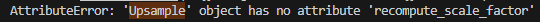
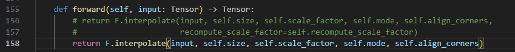
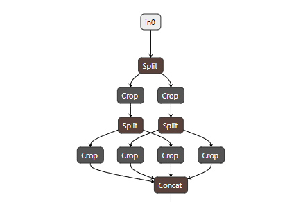
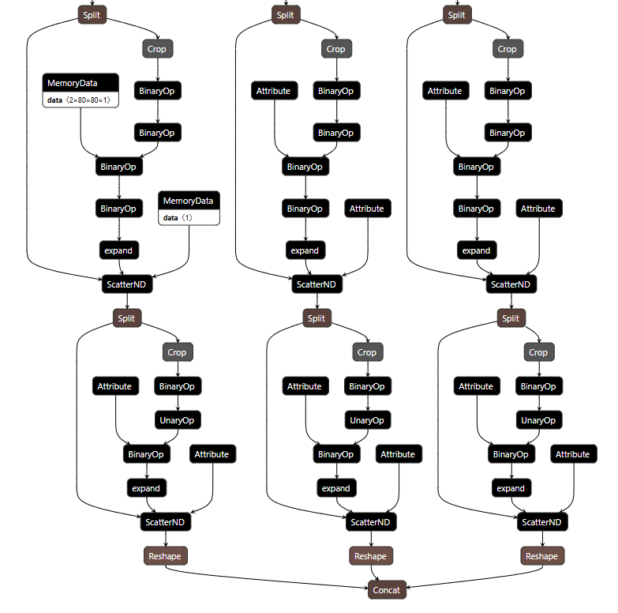

# yolov5

### 模型转换

- 下载模型：[Release v5.0 - YOLOv5-P6 1280 models, AWS, Supervise.ly and YouTube integrations · ultralytics/yolov5](https://github.com/ultralytics/yolov5/releases/tag/v5.0)

  选择5.0的版本的模型文件，新版本的v5已经将Focus模块替换为conv卷积模块，已经不需要再实现Focus算子，这里为了练手，依旧选择有Focus结构的模型

- 转换ncnn模型

  - 转换onnx

    ```
    python models/export --grid
    ```

    需要注意转换过程中可能会出现以下错误（同时也出现由于numpy版本2.x的错误，需要将numpy版本降回1.x，不过没有进行处理，也将模型转换成功）：

    

    修改conda\envs\yolov5\lib\site-packages\torch\nn\modules\upsampling.py

    ```
    return F.interpolate(input, self.size, self.scale_factor, self.mode, self.align_corners)
    ```

    

  - 转换ncnn

    ```
    pnnx yolov5s.onnx inputshape=[1,3,640,640]f32
    ```

    如下图所示，展示了转换模型的Focus结构以及Detect头部，为了实现动态尺寸的推理，需要对param文件加以处理（当然也可以在v5转换onnx时取消--grid选项，这样可以避免处理param文件）

    

    

- python推理

  - without Detect head
  - with Detect head