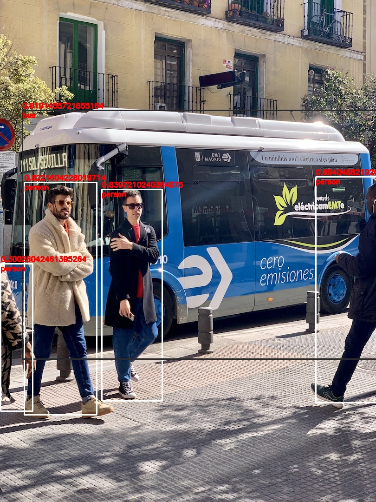
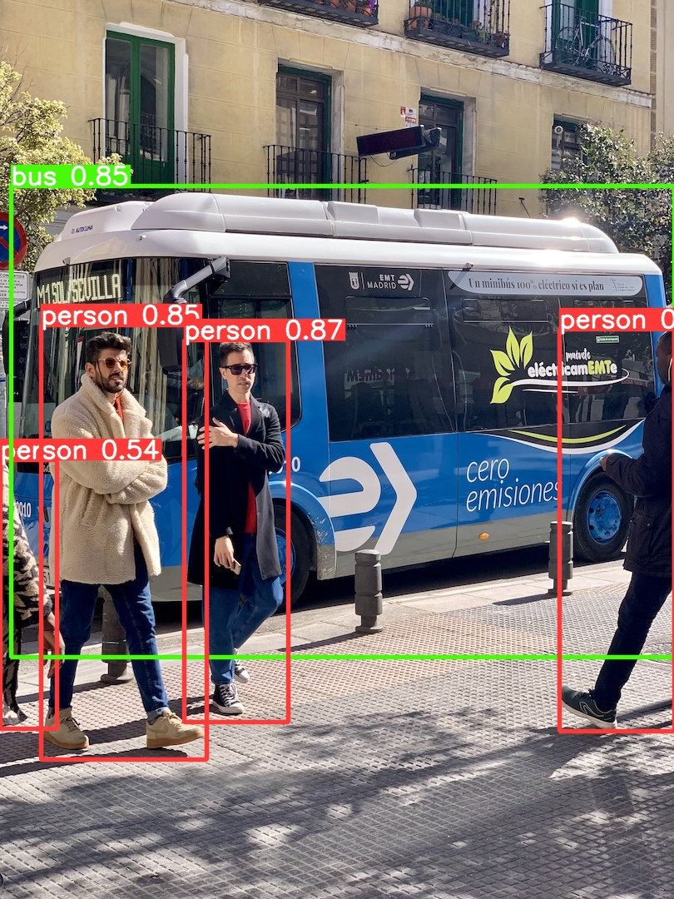
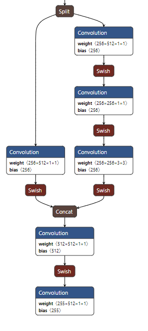
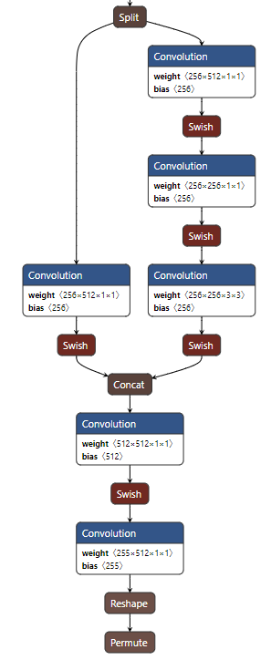

# YOLO v5

- 导出torchscript模型

  ```
  python export.py --data --weights -imgsz --batch-size --include
  ```

- 导出ncnn模型(新版的v5已经将focus模块更换为了卷积操作，可以直接导出)

  ```
  pnnx yolov5n.torchscript inputshape=[1,3,640,640]fp32
  ```

- python demo

  n模型转换ncnn过后，精度下降的有点多，测试s模型时会好一点，具体原因还未探究

  ```
  # -*- coding: utf-8 -*-
  # @Time    : 2024/9/24 10:16
  # @Author  : Lee
  # @File    : demo.py
  # @Description :
  
  
  import argparse
  import cv2
  import ncnn
  import numpy as np
  import sys
  
  
  CLASSES = [
      'person', 'bicycle', 'car', 'motorcycle', 'airplane',
      'bus', 'train', 'truck', 'boat', 'traffic light',
      'fire hydrant', 'stop sign', 'parking meter', 'bench', 'bird',
      'cat', 'dog', 'horse', 'sheep', 'cow',
      'elephant', 'bear', 'zebra', 'giraffe', 'backpack',
      'umbrella', 'handbag', 'tie', 'suitcase', 'frisbee',
      'skis', 'snowboard', 'sports ball', 'kite', 'baseball bat',
      'baseball glove', 'skateboard', 'surfboard', 'tennis racket', 'bottle',
      'wine glass', 'cup', 'fork', 'knife', 'spoon',
      'bowl', 'banana', 'apple', 'sandwich', 'orange',
      'broccoli', 'carrot', 'hot dog', 'pizza', 'donut',
      'cake', 'chair', 'couch', 'potted plant', 'bed',
      'dining table', 'toilet', 'tv', 'laptop', 'mouse',
      'remote', 'keyboard', 'cell phone', 'microwave', 'oven',
      'toaster', 'sink', 'refrigerator', 'book', 'clock',
      'vase', 'scissors', 'teddy bear', 'hair drier', 'toothbrush'
  ]
  
  class Processor(object):
      def __init__(self):
          super().__init__()
  
      def preprocess(self, image_path, input_size):
          # 图片下部分会产生黑边？
          # image = cv2.imdecode(np.fromfile(image_path), cv2.IMREAD_COLOR)
          image = cv2.imread(image_path)
          height, width, _ = image.shape
          max_length = max(height, width)
          ratio = input_size / max_length
          new_height, new_width = int(height * ratio), int(width * ratio)
          mat_in = ncnn.Mat.from_pixels_resize(image, ncnn.Mat.PixelType.PIXEL_BGR2RGB, width, height, new_width,
                                               new_height)
          top, bottom, left, right = (input_size - new_height) // 2, input_size - new_height - (
                      input_size - new_height) // 2, (
                                             input_size - new_width) // 2, input_size - new_width - (
                                                 input_size - new_width) // 2
          mat_in_pad = ncnn.copy_make_border(mat_in, top, bottom, left, right, ncnn.BorderType.BORDER_CONSTANT, 114)
          mat_in_pad.substract_mean_normalize([0,0,0], [1 / 255.0, 1 / 255.0, 1 / 255.0])
          return image, mat_in_pad, top, left, ratio
  
      def postprocess(self,image,output,conf_thresh,nms_thresh,top, left, ratio):
          boxes = output[:,0:4]
          confs = output[:,4]
          classes = output[:,5:]
          indexes = cv2.dnn.NMSBoxes(boxes,confs,conf_thresh,nms_thresh)
          for index in indexes:
              box = boxes[index]
              conf = confs[index]
              cls = np.argmax(classes[index])
              xc,yc,w,h = box
              x1,y1,x2,y2 = int(((xc-w/2)-left)/ratio),int(((yc-h/2)-top)/ratio),int(((xc+w/2)-left)/ratio),int(((yc+h/2)-top)/ratio)
              cv2.rectangle(image, (x1, y1), (x2, y2),
                            (255 // int((cls + 1)), 255 // int((cls + 1)), 255 // int((cls + 1))), 2, 0)
              cv2.putText(image, "{}".format(CLASSES[cls]), (x1, y1 + 15), cv2.FONT_HERSHEY_SIMPLEX, 0.5, (0, 0, 255), 2)
              cv2.putText(image, "{}".format(conf), (x1, y1 - 5), cv2.FONT_HERSHEY_SIMPLEX, 0.5, (0, 0, 255), 2)
          return image
  
  class Detector(object):
      def __init__(self, param_path, bin_path):
          super().__init__()
          self.extractor = self.create_extractor(param_path, bin_path)
  
      def create_extractor(self, param_path, bin_path):
          net = ncnn.Net()
          net.opt.use_vulkan_compute = False
          net.opt.num_threads = 4
          net.load_param(param_path)
          net.load_model(bin_path)
          extractor = net.create_extractor()
  
          return extractor
  
      def infer(self, mat):
          self.extractor.input("in0", mat)
          ret, output = self.extractor.extract("out0")
          output = np.array(output)
          return output
  
  
  def parse_arguments(argv):
      parser = argparse.ArgumentParser()
      parser.add_argument("--image_path", type=str, help="", default="../datas/bus.jpg")
      parser.add_argument("--input_size", type=int, help="", default=640)
      parser.add_argument("--param_path", type=str, help="", default="../models/yolov5n.ncnn.param")
      parser.add_argument("--bin_path", type=str, help="", default="../models/yolov5n.ncnn.bin")
      parser.add_argument("--conf_thresh", type=float, help="", default=0.25)
      parser.add_argument("--nms_thresh", type=float, help="", default=0.45)
      return parser.parse_args(argv)
  
  
  def main(args):
      processor = Processor()
      detector = Detector(args.param_path, args.bin_path)
      image, mat, top, left, ratio = processor.preprocess(args.image_path, args.input_size)
      output = detector.infer(mat)
      image = processor.postprocess(image,output,args.conf_thresh,args.nms_thresh, top, left, ratio)
      cv2.imshow("image",image)
      cv2.waitKey(0)
      cv2.destroyAllWindows()
  
  if __name__ == '__main__':
      main(parse_arguments(sys.argv[1:]))
  ```

  

  

- 动态尺寸推理

  - 包含原本Dtect头的ncnn模型修改为动态尺寸推理失败，param文件如下展示，MemoryData算子以及Reshape算子均存在h与w参数，无法修改实现

    ```
    MemoryData               pnnx_53                  0 1 188 0=2 1=20 11=20 2=3
    MemoryData               pnnx_54                  0 1 189 0=2 1=20 11=20 2=3
    MemoryData               pnnx_55                  0 1 190 0=2 1=40 11=40 2=3
    MemoryData               pnnx_56                  0 1 191 0=2 1=40 11=40 2=3
    MemoryData               pnnx_58                  0 1 192 0=2 1=80 11=80 2=3
    MemoryData               pnnx_60                  0 1 193 0=2 1=80 11=80 2=3
    Convolution              conv_57                  1 1 152 194 0=255 1=1 11=1 12=1 13=1 14=0 2=1 3=1 4=0 5=1 6=16320
    Reshape                  view_131                 1 1 194 195 0=80 1=80 11=85 2=3
    Permute                  permute_128              1 1 195 196 0=3
    Sigmoid                  sigmoid_122              1 1 196 197
    Slice                    split_0                  1 3 197 198 199 200 -23300=3,2,2,81 1=3
    Eltwise                  weighted_sum_0           2 1 198 193 201 0=1 -23301=2,2.000000e+00,1.000000e+00
    BinaryOp                 mul_9                    1 1 201 202 0=2 1=1 2=8.000000e+00
    BinaryOp                 mul_10                   1 1 199 203 0=2 1=1 2=2.000000e+00
    UnaryOp                  pow_11                   1 1 203 204 0=4
    BinaryOp                 mul_12                   2 1 204 192 205 0=2
    Concat                   cat_13                   3 1 202 205 200 206 0=3
    Reshape                  view_132                 1 1 206 207 0=85 1=19200
    ```

  - 去掉Detect头中的后处理操作，直接转换的ncnn模型修改reshape算子并没有实现（存在reshape形状为80*80，这时候修改为-1，并不能将两个都修改为-1），修改输出头，改为三个输出

    ```
        # yolo.py
        def forward(self, x):
            """Processes input through YOLOv5 layers, altering shape for detection: `x(bs, 3, ny, nx, 85)`."""
            z = []  # inference output
            # 处理三个输出头
            for i in range(self.nl):
                # [n,c,20,20]->[n,255,20,20]
                x[i] = self.m[i](x[i])  # conv
                bs, _, ny, nx = x[i].shape  # x(bs,255,20,20) to x(bs,3,20,20,85)
                # [bs,3,85, 20, 20]->[bs,3, 20, 20,85]
                x[i] = x[i].view(bs, self.na, self.no, ny, nx).permute(0, 1, 3, 4, 2).contiguous()
    
            #     if not self.training:  # inference
            #         # 因为推理返回的不是归一化后的网格偏移量 需要再加上网格的位置 得到最终的推理坐标 再送入nms
            #         if self.dynamic or self.grid[i].shape[2:4] != x[i].shape[2:4]:
            #             self.grid[i], self.anchor_grid[i] = self._make_grid(nx, ny, i)
            #
            #         if isinstance(self, Segment):  # (boxes + masks)
            #             xy, wh, conf, mask = x[i].split((2, 2, self.nc + 1, self.no - self.nc - 5), 4)
            #             xy = (xy.sigmoid() * 2 + self.grid[i]) * self.stride[i]  # xy
            #             wh = (wh.sigmoid() * 2) ** 2 * self.anchor_grid[i]  # wh
            #             y = torch.cat((xy, wh, conf.sigmoid(), mask), 4)
            #         else:  # Detect (boxes only)
            #             # 中心点坐标 宽高 置信度
            #             xy, wh, conf = x[i].sigmoid().split((2, 2, self.nc + 1), 4)
            #             # 实现跨网格回归
            #             xy = (xy * 2 + self.grid[i]) * self.stride[i]  # xy
            #             wh = (wh * 2) ** 2 * self.anchor_grid[i]  # wh
            #             y = torch.cat((xy, wh, conf), 4)
            #         z.append(y.view(bs, self.na * nx * ny, self.no))
            #
            # return x if self.training else (torch.cat(z, 1),) if self.export else (torch.cat(z, 1), x)
            return x
    ```

  - 导出模型

    最后的reshape和permute算子没有导出来，不过无关紧要，修改param文件即可

    

  - 修改param文件

    param文件结构：[ncnn/docs/developer-guide/param-and-model-file-structure.md at master · Tencent/ncnn (github.com)](https://github.com/Tencent/ncnn/blob/master/docs/developer-guide/param-and-model-file-structure.md)

    算子：[ncnn/docs/developer-guide/operators.md at master · Tencent/ncnn (github.com)](https://github.com/Tencent/ncnn/blob/master/docs/developer-guide/operators.md)

    需要修改两个位置：

    1. param文件第二行：算子数 数据转换数
    2. 模型原有结尾添加reshape与permute（参看算子文档）

    **注意：添加的reshape算子的形状已经修改为了-1，完成动态尺寸推理的需求**，

    ```
    7767517
    173 197
    ......
    Convolution              conv_57                  1 1 152 800 0=255 1=1 11=1 12=1 13=1 14=0 2=1 3=1 4=0 5=1 6=32640
    Convolution              conv_58                  1 1 170 801 0=255 1=1 11=1 12=1 13=1 14=0 2=1 3=1 4=0 5=1 6=65280
    Convolution              conv_59                  1 1 187 802 0=255 1=1 11=1 12=1 13=1 14=0 2=1 3=1 4=0 5=1 6=130560
    Reshape                  Reshape_20               1 1 800 900 0=-1 1=85 2=3
    Permute                  Transpose_20             1 1 900 out0 0=1
    Reshape                  Reshape_40               1 1 801 901 0=-1 1=85 2=3
    Permute                  Transpose_40             1 1 901 out1 0=1
    Reshape                  Reshape_80               1 1 802 902 0=-1 1=85 2=3
    Permute                  Transpose_80             1 1 902 out2 0=1
    ```

    